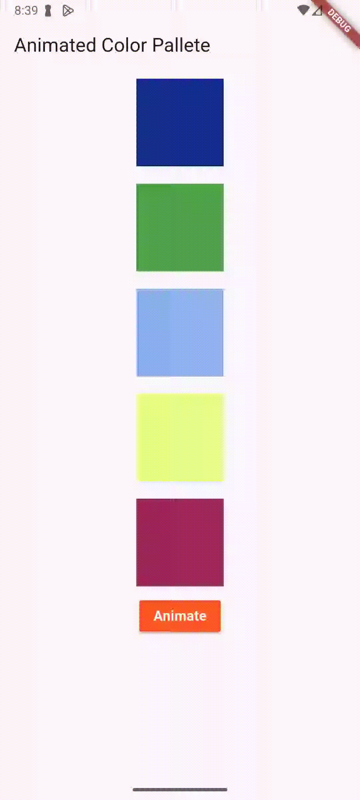
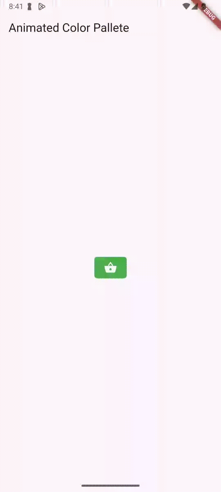
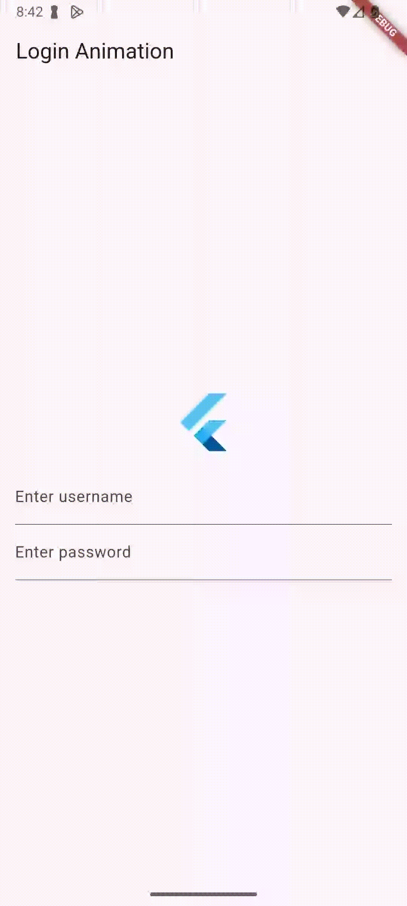
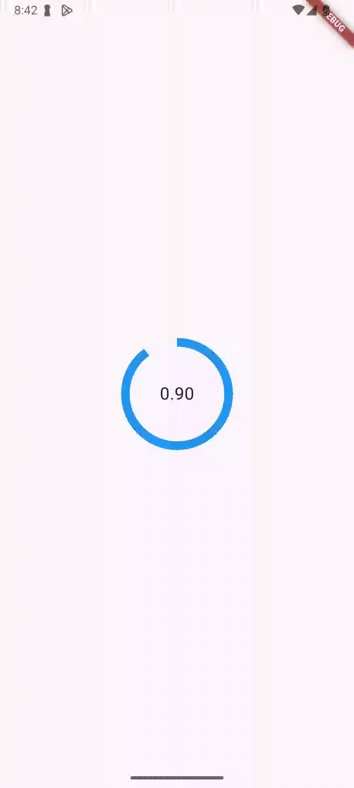
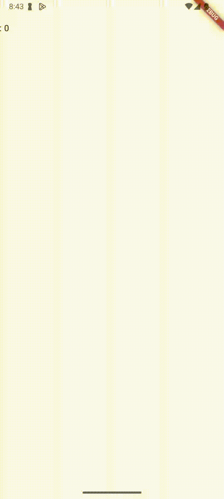
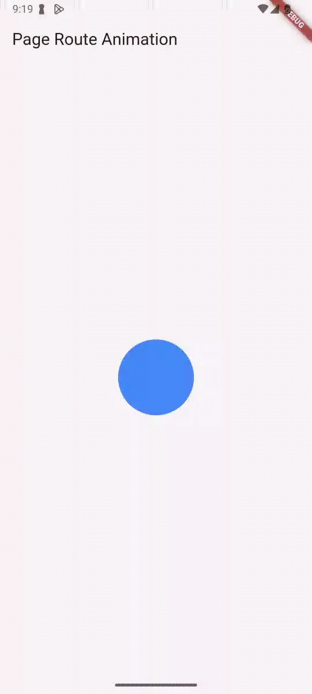
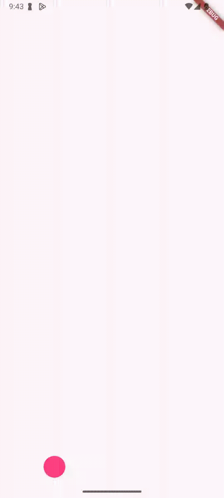

# Basic Animation

1. Implicit Animation
   - Animated Container
   - Tween Animation : Animation without button click, with a builder.
2. Explicit Animation
   - AnimationController
   - Animation
   - Animation with Delay - Interval()
   - AnimatedBuilder - Similar to Tween Animation
3. Page Route Animation
   - Listener
   - Page Transition using PageRouteBuilder
4. Custom Painter

### Screen Recordings

| Animated Color Pallete                                             | Shopping Cart                                    | Circle Pulsating                                   | Login                            |
| ------------------------------------------------------------------ | ------------------------------------------------ | -------------------------------------------------- | -------------------------------- |
|  |  |  |  |

| Loading                              | List                           | Page Route                                 | Bouncing Balll                                    |
| ------------------------------------ | ------------------------------ | ------------------------------------------ | ------------------------------------------------- |
|  |  |  |  |

| Card Animation                              | -                           | -                                 | -                                    |
| ------------------------------------ | ------------------------------ | ------------------------------------------ | ------------------------------------------------- |
|  | - | - | - |
